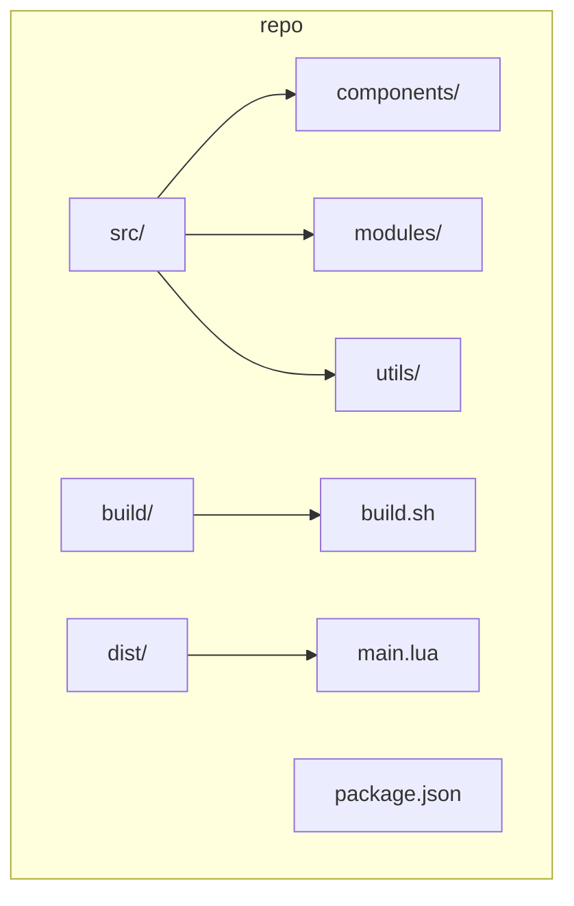

<!--<h1 align="center">WindUI</h1> -->

<!--
<picture>
    <source srcset="docs/banner-dark.webp" media="(prefers-color-scheme: dark)">
    <source srcset="docs/banner-light.webp" media="(prefers-color-scheme: light)">
    
</picture>-->

# SkidLarpMaxxingLib (WindUI fork)

Lightweight Roblox UI library originally published as WindUI. This repository contains the source (`src/`) and a build pipeline that bundles the library into `dist/main.lua` using DarkLua (via Aftman).

**Primary language:** Lua (Roblox / Luau)

## Quick summary

- Library entry: `src/Init.lua` (exports `WindUI` API)
- Build: `npm run build` (calls `build/build.sh`, uses `darklua` to bundle)
- Dev: `npm run dev` to run the build in dev mode
- Tooling: Node.js (for dev scripts), Python3 (optional utilities), Aftman-managed tools (`darklua`, `rojo`, `lune`)

## Requirements

- Git
- Node.js (>=18 recommended)
- npm (bundled with Node.js)
- Python 3 (for some helper scripts, optional)
- Aftman (recommended) or a system `darklua` binary accessible on `PATH`

Note: Building and releasing this project do not require Roblox Studio — the build pipeline runs DarkLua and other tooling on CI or your machine.

See `install.sh` for an automated environment check and recommendations.

## Installing dependencies

On a fresh environment, run:

```bash
bash install.sh
```

This script verifies Node.js, npm and Python and then runs `npm install`. It will check for `darklua` and suggest how to install it (via Aftman or manual install).

## Build

Build the distribution bundle:

```bash
npm install
npm run build
```

Output: `dist/main.lua` (this is the bundled library with header metadata).

## Usage

Load the bundled library in your Roblox environment (example):

```lua
-- from raw GitHub (this repository)
loadstring(game:HttpGet('https://raw.githubusercontent.com/TheWildKaden/SkidLarpMaxxingLib/main/dist/main.lua'))()

-- or include `dist/main.lua` in your project
local WindUI = require(path.to.dist.main)
-- Example API calls (available on `WindUI`):
-- WindUI:CreateWindow(Config)
-- WindUI:Notify(Config)
-- WindUI:SetTheme(name)
-- WindUI:AddTheme(themeTable)
-- WindUI:SetLanguage(code)
-- WindUI:ToggleAcrylic(bool)
-- WindUI:Gradient(stops, props)
-- WindUI:Popup(config)
```

Refer to `src/Init.lua` and the `components/` folder for concrete options accepted by each API call.

## Project structure



## Architecture (runtime)

```mermaid
flowchart LR
    Player --> WindUI[WindUI (ScreenGui)]
    WindUI --> Window[Window Component]
    WindUI --> Notification[Notification Component]
    WindUI --> Popup[Popup Component]
    WindUI --> Creator[Creator Module]
    Creator --> Elements[UI Elements]
```

## Build flow

```mermaid
flowchart LR
    dev-scripts[dev scripts (npm)] --> build.sh
    build.sh --> darklua[DarkLua]
    darklua --> dist/main.lua
    dist/main.lua --> header.lua
```

## GitHub Actions

The repository already includes workflows in `.github/workflows/`:

- `build.yml` — runs on push to `main`, installs Node, Lua, Aftman tools and builds `dist/main.lua`.
- `pull_request.yml` — builds PRs and comments build status back to the PR.
- `release.yml` — packages releases when a tag is pushed.

These workflows use `aftman` to install `darklua` and other tooling on the runner.

## Development

- Recommended: use the included devcontainer for a reproducible environment (see `.devcontainer/`).
- To run a continuous dev build you can use `npm run dev`.

## Contributing

See `CONTRIBUTING.md` for contribution guidance and `SECURITY.md` for reporting vulnerabilities.

## License

This project is licensed under the MIT License — see `LICENSE`.

## Changelog

See `CHANGELOG.md` for release history.

## Credits

This project is originally authored by Footagesus and uses community icon sets (see original README for details).

